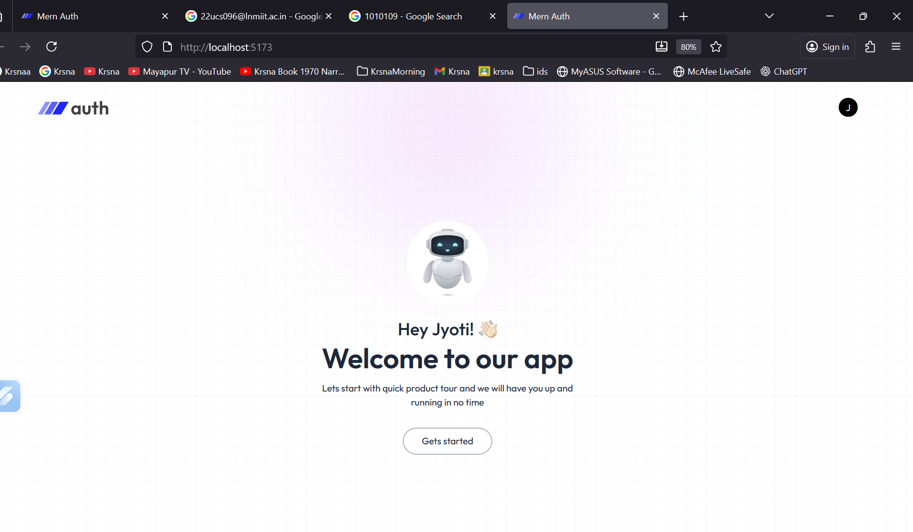
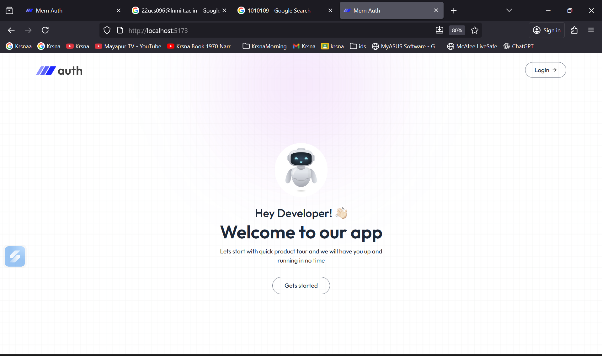
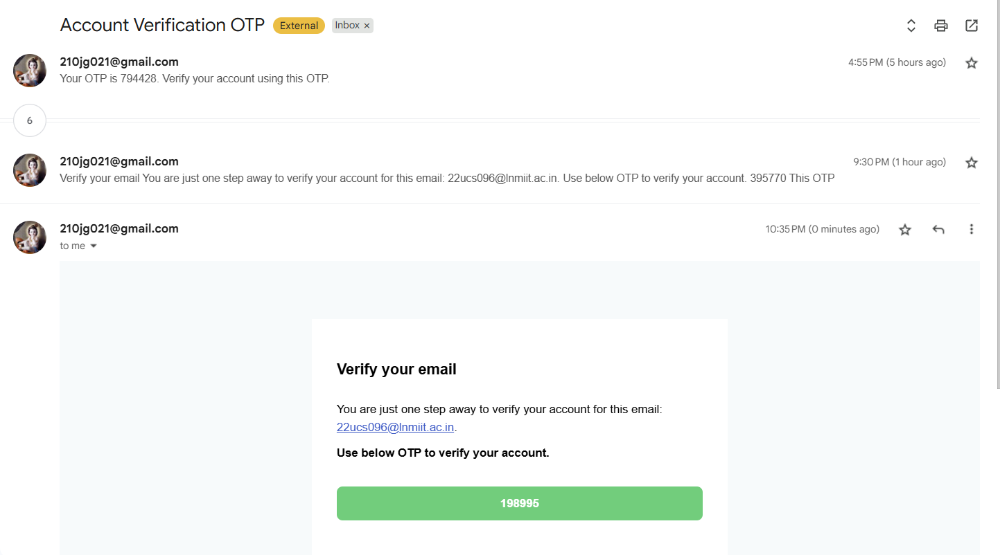
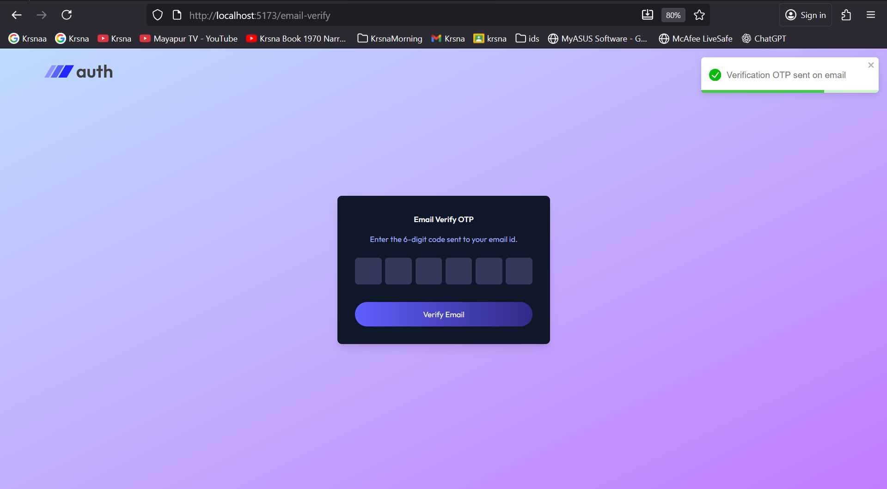
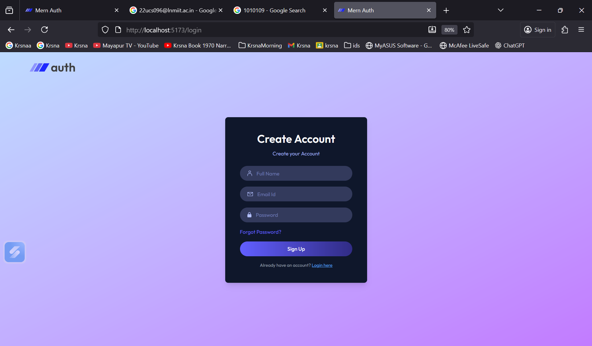
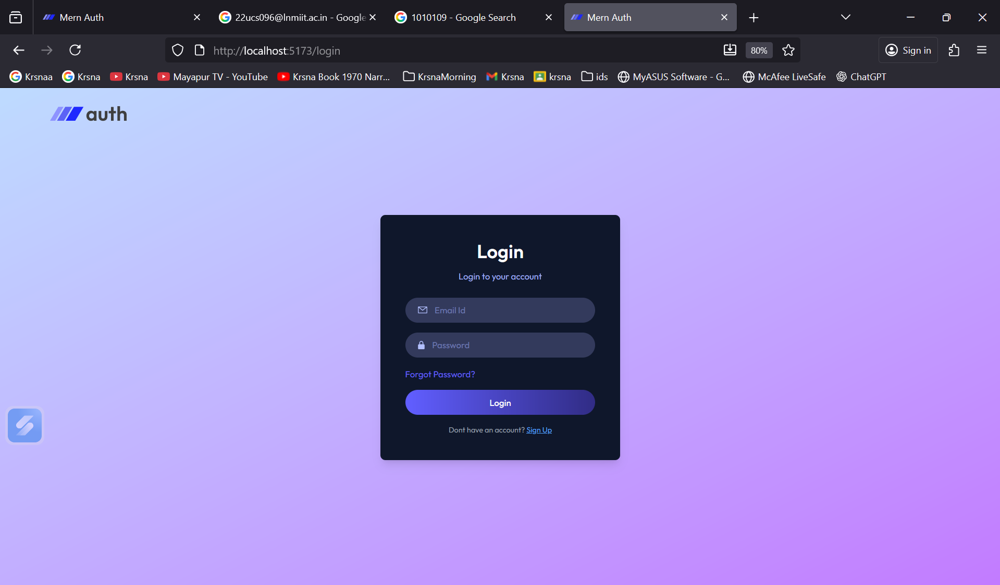
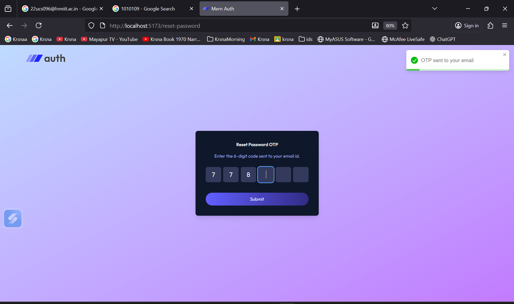
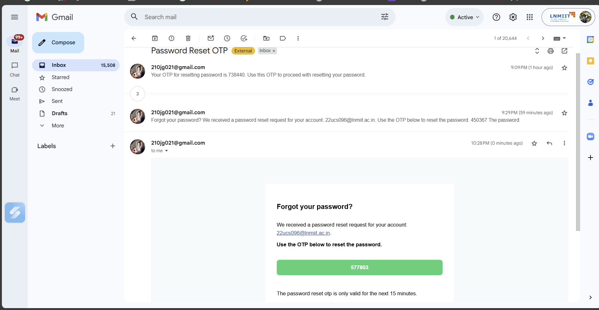

# 🔐 Authentication System  


> A **full-stack authentication system** built with **React, Node.js, Express, and MongoDB**, supporting **email verification**, **OTP-based password reset**, and **JWT authentication** — secure, scalable, and easy to use.
---
## 🚀 Live Demo

**Try it now:** [Authentication System Live Demo](https://authentication-system-five-khaki.vercel.app)

---

## 🧠 Table of Contents
- [✨ Features](#-features)
- [🧩 Tech Stack](#-tech-stack)
- [⚙️ Installation & Setup](#️-installation--setup)
- [📁 Folder Structure](#-folder-structure)
- [🖼️ Screenshots](#️-screenshots)
- [📬 Contact](#-contact)

---

## ✨ Features

✅ User Registration & Login  
✅ JWT-based Authentication  
✅ Email Verification with OTP  
✅ Password Reset via OTP  
✅ Protected API Routes  
✅ React Frontend with Context API  
✅ Toast Notifications for Feedback  
✅ Beautiful UI built with Tailwind CSS  

---

## 🧩 Tech Stack

| Layer | Technologies Used |
|-------|--------------------|
| **Frontend** | React, Tailwind CSS, Axios, React Toastify |
| **Backend** | Node.js, Express.js, MongoDB, JWT, Nodemailer |
| **Tools** | Vite, dotenv, bcryptjs, cookie-parser |

---

## ⚙️ Installation & Setup

### 1️⃣ Clone this Repository
```bash
git clone https://github.com/21Jyoti21/Authentication-System.git
cd Authentication-System
```

### 2️⃣ Backend Setup
```bash
cd backend
npm install
```

Create a `.env` file in `/backend`:
```
MONGO_URI=your_mongodb_connection_string
JWT_SECRET=your_secret_key
EMAIL_USER=your_email_address
EMAIL_PASS=your_app_password
CLIENT_URL=http://localhost:5173
PORT=4000
```

Run backend:
```bash
npm start
```

### 3️⃣ Frontend Setup
```bash
cd ../frontend
npm install
npm run dev
```

Visit 👉 `http://localhost:5173`  

---

## 📁 Folder Structure
```
Authentication-System/
├── backend/
│   ├── controllers/
│   ├── models/
│   ├── routes/
│   ├── middleware/
│   ├── server.js
│   └── .env
├── frontend/
│   ├── src/
│   ├── public/
│   ├── package.json
│   └── vite.config.js
└── README.md
```
---

## 🖼️ Screenshots

### 🪄 Register Page



### ✉️ Email Verification



### 🔑 Login Page



### 🔁 Password Reset




---

## 💡 Future Enhancements
- Add Google / GitHub OAuth login  
- Implement Refresh Tokens  
- Add Dark Mode toggle  
- Add Role-Based Authorization  

---

## 📬 Contact

👩‍💻 **Author:** Jyoti Kumari  
📧 **Email:** [22ucs096@lnmiit.ac.in](mailto:22ucs096@lnmiit.ac.in)  
🌐 **GitHub:** [21Jyoti21](https://github.com/21Jyoti21)  

---

## ⭐ Support  
If you found this project helpful, please give it a ⭐ on GitHub — it motivates me to keep building!

---

## 📝 License  
This project is licensed under the [MIT License](LICENSE).
